# Focus-Then-Reuse: Fast Adaptation in Visual Perturbation Environments

This repository contains the code for the NeurIPS 2025 paper: Focus-Then-Reuse: Fast Adaptation in Visual Perturbation Environments.

## Installation

You can directly install the dependencies using the provided `setup.sh` file.

```sh
./setup.sh
```

Please refer to [this page](https://help.aliyun.com/zh/model-studio/get-api-key) to acquire the API key, and then set the environment variable `DASHSCOPE_API_KEY` to your API key.

```sh
export DASHSCOPE_API_KEY="your-api-key"
```

Please run the following command to download the pretrained SAM 2 model weights:

```sh
./src/segment-anything-2-real-time/checkpoints/download_ckpts.sh
```

More details can be found in the official [SAM-2](https://github.com/facebookresearch/sam2?tab=readme-ov-file#sam-2-checkpoints) repository.

## Run

Below are running commands of running FTR and baseline algorithms. 

1. Train the original policy in clean environment using DrQ-v2 algorithm.

    Please replace *env* and *task* with corresponding arguments 
(e.g. ./scripts/train.sh franka reach). 

    ```sh
    ./scripts/train.sh env task
    ```

    The model will be saved in `./log_dir/env_task/algorithm/time/model` folder.

2. Adapt the original policy in the perturbed environment using FTR.

    Please first refer to [this page](https://help.aliyun.com/zh/model-studio/get-api-key) to acquire the API key, and then `export DASHSCOPE_API_KEY="your-api-key"`.

    Then fill in the `adapt-all.sh` file with the corresponding model paths.

    ```sh
    ./scripts/adapt-all.sh
    ```


3. To run the ablation study, please refer to `./scripts/ablation-*.sh`

For more parameter settings, please refer to `arguments.py`.

If you encounter problems related to rendering, please refer to respiratory of 
[DMC](https://github.com/google-deepmind/dm_control)

## Visualization

The following videos show the performance in the perturbed environments. The video consists of three parts: left, middle, and right. The left part represents $o_t \in \mathbb{R}^{C\times W \times H}$, the observation of the perturbed environment with $C$ channels, width $W$ and height $H$ at time $t$. The middle part represents the result of the previous selection pathway, including segments $o^{\text{seg}} = \{o^{\text{seg}_i} \mid i = 1, \ldots, 9, o^{\text{seg}_i} \in \mathbb{R}^{C\times W \times H}\}$ and the selection result of the segments (the $\text{probability}$ of each segments, a segment is selected if its $\text{probability} > 0.5$). The right part $o_t^{\text{sel}}$ represents the selected objects $o_t^{\text{sel}} \in \mathbb{R}^{C\times W \times H}$, which is gained either through the selection pathway or the tracking pathway. $o_t^{\text{sel}}$ are fed into the original policy, which is acquired via pre-training in a clean environment, to obtain the action.

<div style="display: flex; justify-content: center;">
    <div style="flex: 0 0 100%; text-align: center;">
        <figure>
            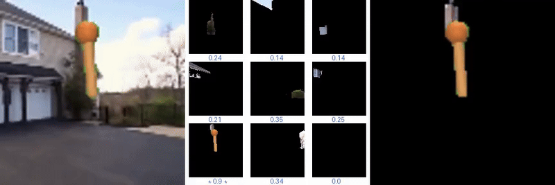
            <figcaption>pendulum-swingup</figcaption>
        </figure>
    </div>
</div>

<div style="display: flex; justify-content: center;">
    <div style="flex: 0 0 100%; text-align: center;">
        <figure>
            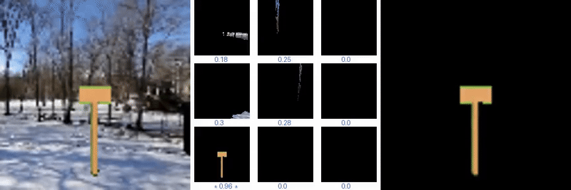
            <figcaption>cartpole-swingup</figcaption>
        </figure>
    </div>
</div>

<div style="display: flex; justify-content: center;">
    <div style="flex: 0 0 100%; text-align: center;">
        <figure>
            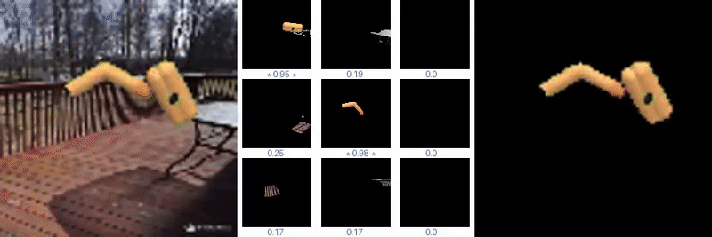
            <figcaption>finger-spin</figcaption>
        </figure>
    </div>
</div>

<div style="display: flex; justify-content: center;">
    <div style="flex: 0 0 100%; text-align: center;">
        <figure>
            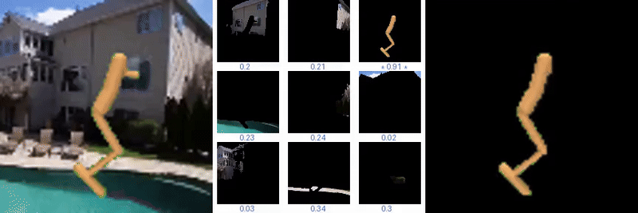
            <figcaption>hopper-stand</figcaption>
        </figure>
    </div>
</div>

<div style="display: flex; justify-content: center;">
    <div style="flex: 0 0 100%; text-align: center;">
        <figure>
            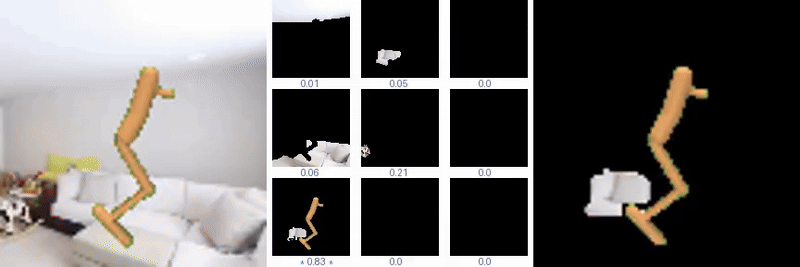
            <figcaption>hopper-hop</figcaption>
        </figure>
    </div>
</div>

<div style="display: flex; justify-content: center;">
    <div style="flex: 0 0 100%; text-align: center;">
        <figure>
            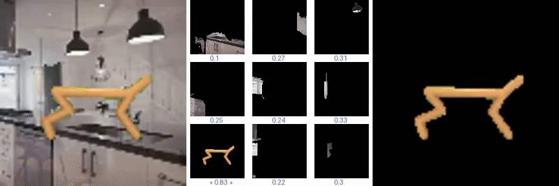
            <figcaption>cheetah-run</figcaption>
        </figure>
    </div>
</div>

<div style="display: flex; justify-content: center;">
    <div style="flex: 0 0 100%; text-align: center;">
        <figure>
            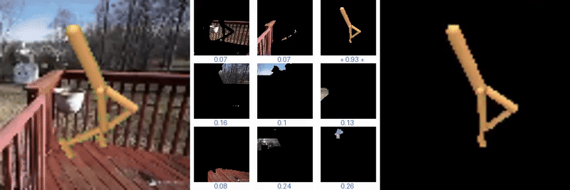
            <figcaption>walker-walk</figcaption>
        </figure>
    </div>
</div>

<div style="display: flex; justify-content: center;">
    <div style="flex: 0 0 100%; text-align: center;">
        <figure>
            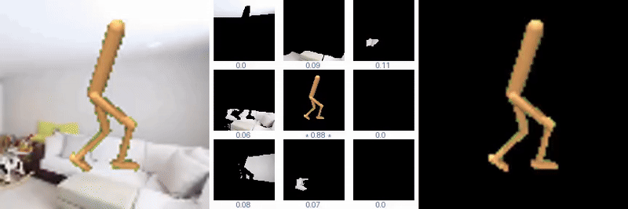
            <figcaption>walker-run</figcaption>
        </figure>
    </div>
</div>

<div style="display: flex; justify-content: center;">
    <div style="flex: 0 0 100%; text-align: center;">
        <figure>
            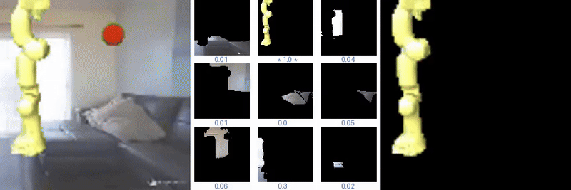
            <figcaption>franka-reach</figcaption>
        </figure>
    </div>
</div>

<div style="display: flex; justify-content: center;">
    <div style="flex: 0 0 100%; text-align: center;">
        <figure>
            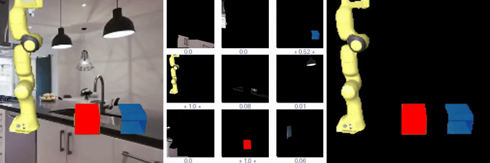
            <figcaption>franka-push</figcaption>
        </figure>
    </div>
</div>

<div style="display: flex; justify-content: center;">
    <div style="flex: 0 0 100%; text-align: center;">
        <figure>
            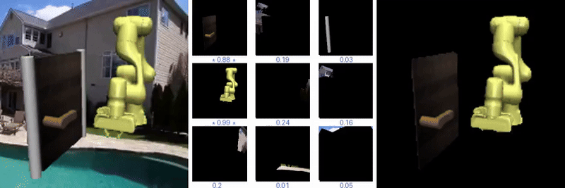
            <figcaption>franka-door</figcaption>
        </figure>
    </div>
</div>


## Acknowledgements
This code is built on top of the repositorys: [DMControl Generalization Benchmark](https://github.com/nicklashansen/dmcontrol-generalization-benchmark) and [FTD](https://github.com/LAMDA-RL/FTD).

The PPO implementation is based on [The 37 Implementation Details of Proximal Policy Optimization](https://iclr-blog-track.github.io/2022/03/25/ppo-implementation-details/).

The DrQ-v2 implementation is based on [DrQ-v2](https://github.com/facebookresearch/drqv2).

The SAM implementation is based on [SAM-2 real-time](https://github.com/Gy920/segment-anything-2-real-time).
